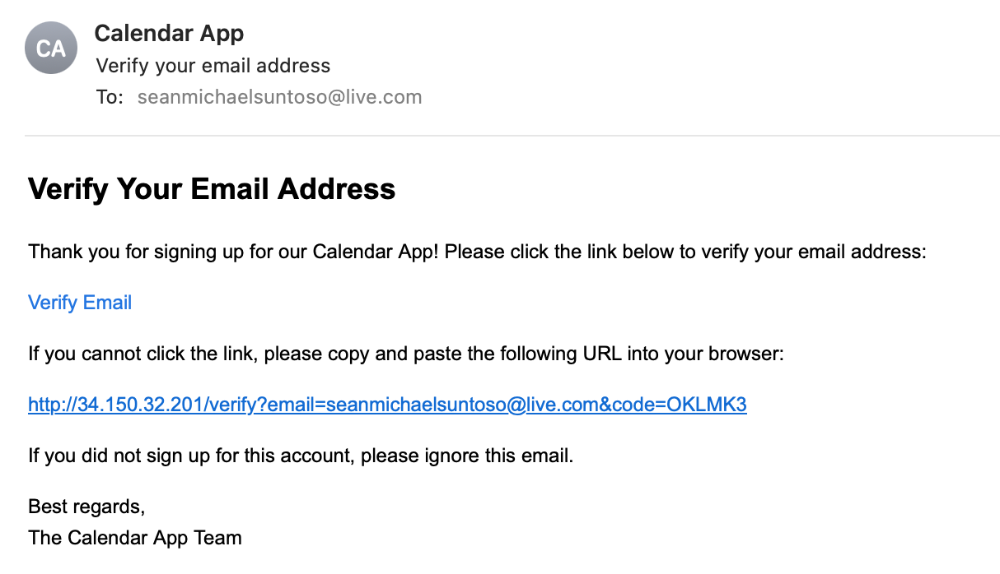

# Calender Web App
This app is design to allow user to have a schedule planner. It will send reminder **15 minutes before the event**.
 
Current release: 

## Demo & Documentation
This applocation is deployed to Google Cloud using Cloud Run service at [https://calendar-app-114734088432.asia-east2.run.app](https://calendar-app-114734088432.asia-east2.run.app).
To run localy and test or deploy with your own server, refer to the readme file inside the [frontend](frontend/README.md) and [backend](backend/README.md) folder of this repo. Refer to this [API swagger](backend/calendar-api-swagger.yaml) for API documentation.

## Tech Stack 
- React 
- Tailwind CSS
- Syncfusion Scheduler
- Express
- PostgreSQL
- Node.js

## Database Schema
This schema is created with SQL database in mind. In this project, I use PostgreSQL database 
### User Table
| Column | Data Type | Example | Required | Remark |
|---|---|---|---|---|
| user_id | integer | 1 | true | auto increment and is primary key |
| email | varchar(255) | john@doe.com | true | |
| password | varchar(128) | $2a$10$CwTycUXWue | false | hashed |
| google_token | varchar | eyJhbGciOiJsunskjad | false | for Google OAuth only |
| verify | boolean | true | true | |
| verification_code | varchar(10) | OKLMK3 | false | No need to verify for Signup with Google |
| reset_code | varchar(10) | 5V14MI | false | |
| reset_exp | varchar(10) | 1733082252 | false | epoch for reste code expiry |

### Calendar Table
| Column | Data Type | Example | Required | Remark |
|---|---|---|---|---|
| calendar_id | integer | 2 | true | auto increment and is primary key |
| user_id | integer | 1 | true | |
| subject_id | integer | 2 | true | |
| subject | varchar(255) | Meeting with John | true | |
| start_time_zone | varchar(100) | Asia/Hong_Kong | true | |
| start_time | timestamp without timezone | 2024-11-25 13:00:00 | true | |
| end_time_zone | varchar(100) | Asia/Hong_Kong | true | |
| end_time | timestamp without timezone | 2024-11-25 14:00:00 | true | |
| all_day_event | boolean | true | true | |
| description | varchar(4000) | Meeting to talk about upcoming project | flase | |
| location | varchar(255) | Office | flase | |

## Deployment Diagram

## Sample Email
Reminder Email  

 
 
Verification Email  

## Notes
- Frontend calender will display time in Asia/Hong_Kong Timezone. The scheduler itself support multiple timezone.